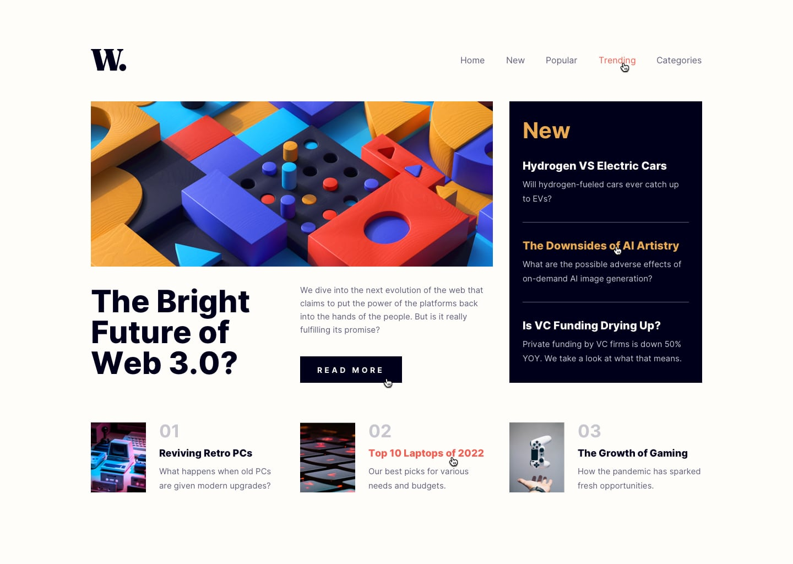

# Frontend Mentor - News homepage

## The challenge

This challenge is to build out this news website homepage and get it looking as close to the design as possible.

We can use any tools we like to help us complete the challenge. 

Users should be able to:

- View the optimal layout for the interface depending on their device's screen size
- See hover and focus states for all interactive elements on the page

Here we can find both a mobile and a desktop version of the design: 

## Front-end Style Guide

The designs are in JPG static format. Using JPGs will mean that we'll need to use our best judgment for styles such as `font-size`, `padding` and `margin`.

## Layout

The designs were created to the following widths:

- Mobile: 375px
- Desktop: 1440px

## Colors

- Soft orange: hsl(35, 77%, 62%)
- Soft red: hsl(5, 85%, 63%)
- Off-white: hsl(36, 100%, 99%)
- Grayish blue: hsl(233, 8%, 79%)
- Dark grayish blue: hsl(236, 13%, 42%)
- Very dark blue: hsl(240, 100%, 5%)

## Typography

- Font size (paragraph): 15px
- Family: [Inter](https://fonts.google.com/specimen/Inter)
- Weights: 400, 700, 800

